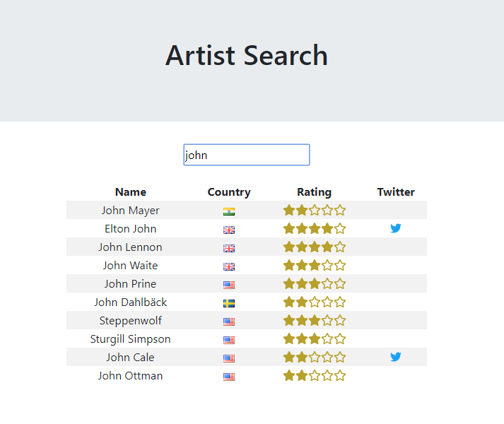

# Artist Search

Find information about an artist.
This application was developed to practice React.
  

  
What was used:

 - [React](https://reactjs.org/) to build the front-end;
 - [Musicmatch API](https://developer.musixmatch.com/) to retrieve information about the artists;
 - [axios](https://github.com/axios/axios) to facilitate Musicmatch information retrieving;
 - [Fontawesome](https://fontawesome.com/) for Twitter and stars icons;
 - [Flag Sprites](https://www.flag-sprites.com/) for the flags;
 - [Visual Studio Code](https://code.visualstudio.com/) to develop.
